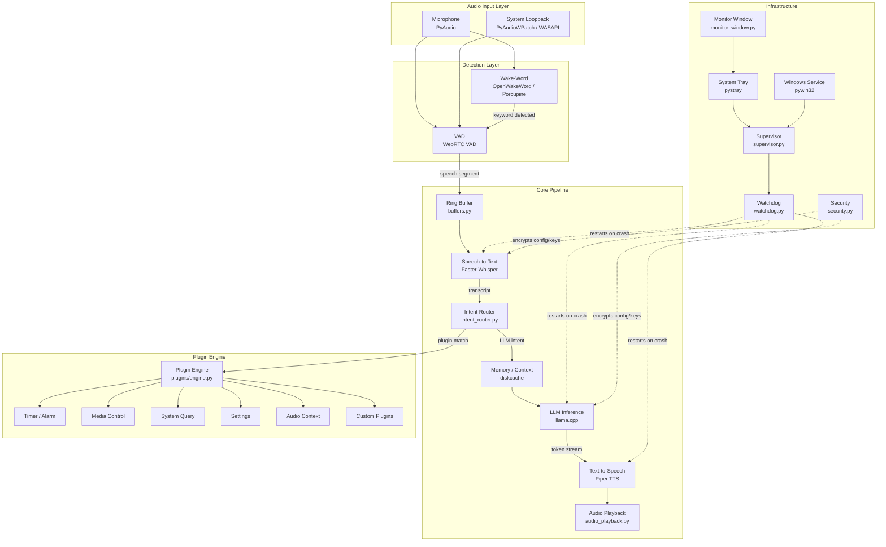
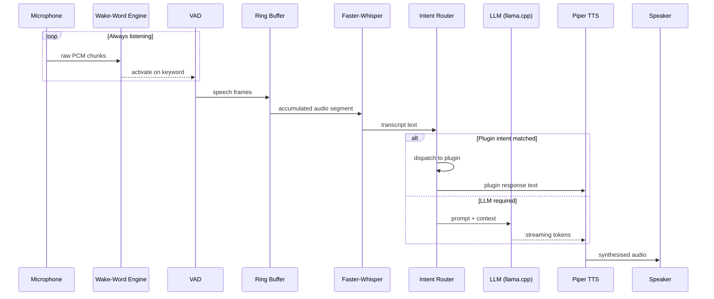
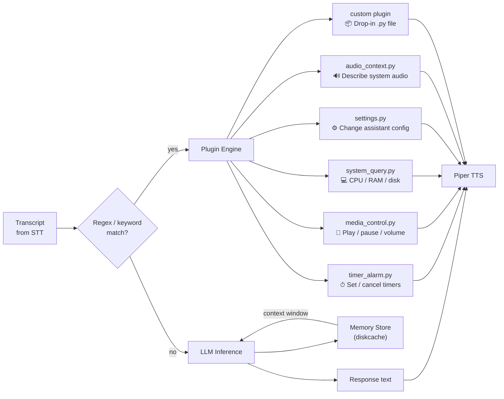
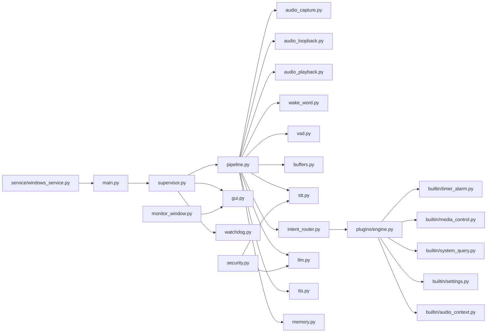
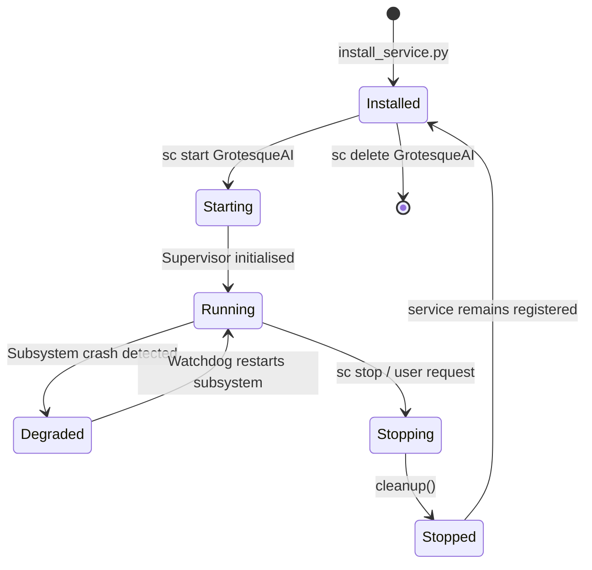

# Grotesque AI

> A fully **offline**, privacy-first voice assistant for Windows, powered by local LLMs, Whisper STT, Piper TTS, and a hot-pluggable intent-router plugin system.

---

## Table of Contents

1. [Overview](#overview)
2. [Feature Highlights](#feature-highlights)
3. [System Architecture](#system-architecture)
4. [Audio Pipeline](#audio-pipeline)
5. [Intent Router & Plugin System](#intent-router--plugin-system)
6. [Module Dependency Graph](#module-dependency-graph)
7. [Windows Service Lifecycle](#windows-service-lifecycle)
8. [Requirements & Installation](#requirements--installation)
9. [Configuration](#configuration)
10. [Running the Assistant](#running-the-assistant)
11. [Plugin Development](#plugin-development)
12. [Project Structure](#project-structure)
13. [Model Downloads](#model-downloads)
14. [Security](#security)
15. [License](#license)

---

## Overview

Grotesque AI is a **100 % local** voice assistant pipeline. No cloud services, no telemetry. Every byte of audio is processed on-device using:

| Layer | Technology |
|---|---|
| Wake-word detection | OpenWakeWord / PvPorcupine |
| Voice Activity Detection | WebRTC VAD |
| Speech-to-Text | Faster-Whisper (CTranslate2) |
| Language Model | llama.cpp (Meta-Llama-3-8B-Instruct Q4_K_M) |
| Text-to-Speech | Piper TTS (ONNX, en-US Amy) |
| Audio I/O | PyAudio / PyAudioWPatch (WASAPI loopback) |
| Plugin engine | Built-in + hot-loaded Python plugins |
| Windows service | pywin32 / WMI |

---

## Feature Highlights

- **Zero-latency wake-word** — continuous always-on KW detection without blocking inference
- **VAD-gated capture** — only sends speech segments; ignores silence and background noise
- **Streaming LLM inference** — token-by-token generation fed directly into the TTS queue
- **WASAPI loopback** — can listen to *system audio* for transcription / captioning
- **Pluggable intent router** — route commands to timers, media control, system queries, and custom plugins without touching core code
- **Persistent memory** — disk-cached conversation context with eviction policy
- **System-tray GUI** — lightweight pystray interface; no heavy GUI framework required
- **Windows service** — install as a background service that survives user logoff
- **Supervisor + Watchdog** — automatic crash recovery for all subsystems

---

## System Architecture



---

## Audio Pipeline



---

## Intent Router & Plugin System



---

## Module Dependency Graph



---

## Windows Service Lifecycle



---

## Requirements & Installation

### Prerequisites

| Requirement | Version |
|---|---|
| Python | 3.10 – 3.12 |
| Windows | 10 / 11 (WASAPI loopback requires Windows) |
| CUDA (optional) | 12.x for GPU acceleration |
| RAM | 8 GB minimum, 16 GB recommended |
| Disk | ~6 GB for all models |

### Install

```powershell
# 1. Clone the repo
git clone https://github.com/your-org/grotesque-ai.git
cd grotesque-ai

# 2. Create and activate a virtual environment
python -m venv .venv
.venv\Scripts\Activate.ps1

# 3. Install dependencies
pip install -r requirements.txt

# 4. Download models
python scripts/download_models.py

# 5. (Optional) Build llama.cpp with CUDA support
.\scripts\build_llama_cpp.ps1
```

---

## Configuration

Edit `config/config.yaml` to customise behaviour:

```yaml
wake_word:
  engine: openwakeword        # openwakeword | porcupine
  model: hey_jarvis            # model name / path
  threshold: 0.5

vad:
  aggressiveness: 2            # 0–3 (3 = most aggressive filtering)
  silence_duration_ms: 800

stt:
  model: medium                # tiny | base | small | medium | large-v3
  language: en
  device: cuda                 # cuda | cpu
  compute_type: int8_float16

llm:
  model_path: models/llm/Meta-Llama-3-8B-Instruct-Q4_K_M.gguf
  n_gpu_layers: 35             # 0 = CPU only
  context_length: 4096
  temperature: 0.7
  max_tokens: 512

tts:
  model: models/tts/en_US-amy-medium.onnx
  speaker: 0
  length_scale: 1.0            # speech rate (>1 = slower)

memory:
  max_turns: 20
  cache_dir: .cache/memory

security:
  encrypt_config: false
  key_file: .keys/secret.key

audio:
  input_device: default
  output_device: default
  sample_rate: 16000
  chunk_size: 1024
```

---

## Running the Assistant

```powershell
# Interactive (foreground)
python main.py

# Run hidden (no console window)
wscript run_covert.vbs

# Install as a Windows service
python service\install_service.py install
sc start GrotesqueAI
```

---

## Plugin Development

Drop a `.py` file into `core/plugins/builtin/` (or a custom path configured in `config.yaml`). Implement the plugin interface:

```python
from core.plugins.engine import BasePlugin, IntentMatch

class MyPlugin(BasePlugin):
    name = "my_plugin"

    # Return an IntentMatch if this plugin handles the transcript,
    # otherwise return None to pass to the next handler.
    def match(self, transcript: str) -> IntentMatch | None:
        if "do something" in transcript.lower():
            return IntentMatch(plugin=self, transcript=transcript)
        return None

    def execute(self, match: IntentMatch) -> str:
        return "Done! I did the thing."
```

The plugin engine auto-discovers and hot-reloads plugins — no restart needed.

---

## Project Structure

```
grotesque-ai/
├── main.py                   # Entry point
├── run_covert.vbs            # Silent background launcher
├── pyproject.toml
├── requirements.txt
├── config/
│   └── config.yaml           # All runtime configuration
├── core/
│   ├── pipeline.py           # Orchestrates the full audio→response flow
│   ├── audio_capture.py      # Microphone input
│   ├── audio_loopback.py     # WASAPI system-audio capture
│   ├── audio_playback.py     # Speaker output
│   ├── buffers.py            # Thread-safe ring buffers
│   ├── wake_word.py          # OpenWakeWord / Porcupine integration
│   ├── vad.py                # WebRTC VAD gating
│   ├── stt.py                # Faster-Whisper STT
│   ├── llm.py                # llama.cpp LLM inference
│   ├── tts.py                # Piper TTS synthesis
│   ├── intent_router.py      # Transcript → plugin or LLM routing
│   ├── memory.py             # Conversation context (diskcache)
│   ├── gui.py                # pystray system-tray interface
│   ├── monitor_window.py     # Live transcript / status overlay
│   ├── security.py           # Config encryption, key management
│   ├── supervisor.py         # Subsystem lifecycle management
│   └── watchdog.py           # Crash detection & recovery
│   └── plugins/
│       ├── engine.py         # Plugin discovery & dispatch
│       └── builtin/
│           ├── timer_alarm.py
│           ├── media_control.py
│           ├── system_query.py
│           ├── settings.py
│           └── audio_context.py
├── models/
│   ├── llm/                  # GGUF model files
│   ├── stt/                  # Faster-Whisper model cache
│   ├── tts/                  # Piper ONNX voice models
│   └── wake/                 # Wake-word model files
├── scripts/
│   ├── download_models.py
│   ├── build_llama_cpp.ps1
│   ├── setup.ps1
│   ├── benchmark.py
│   └── stress_test.py
├── service/
│   ├── windows_service.py    # pywin32 service wrapper
│   └── install_service.py
└── docs/
    ├── ARCHITECTURE.md
    └── DEPLOYMENT.md
```

---

## Model Downloads

| Model | Size | Purpose |
|---|---|---|
| `Meta-Llama-3-8B-Instruct-Q4_K_M.gguf` | ~4.9 GB | LLM inference |
| `faster-whisper-medium` | ~1.5 GB | Speech-to-Text |
| `faster-whisper-small` | ~460 MB | Fast STT fallback |
| `en_US-amy-medium.onnx` | ~63 MB | Text-to-Speech |

Run `python scripts/download_models.py` to fetch all models automatically from HuggingFace Hub.

---

## Security

- All config files can be AES-256 encrypted at rest via `security.py`
- API keys (e.g. Porcupine access key) are stored in a separate key file, never in `config.yaml`
- No outbound network connections during normal operation — all inference is local
- The `cryptography` package (PyCA) provides all cryptographic primitives

---

## License

This project is licensed under the **MIT License**. See [LICENSE](LICENSE) for details.
